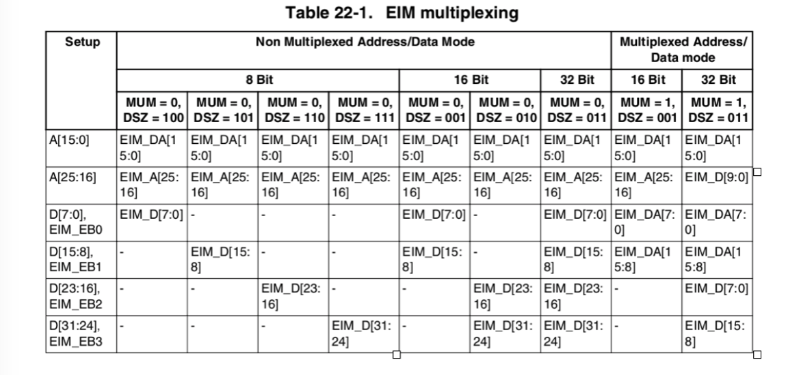
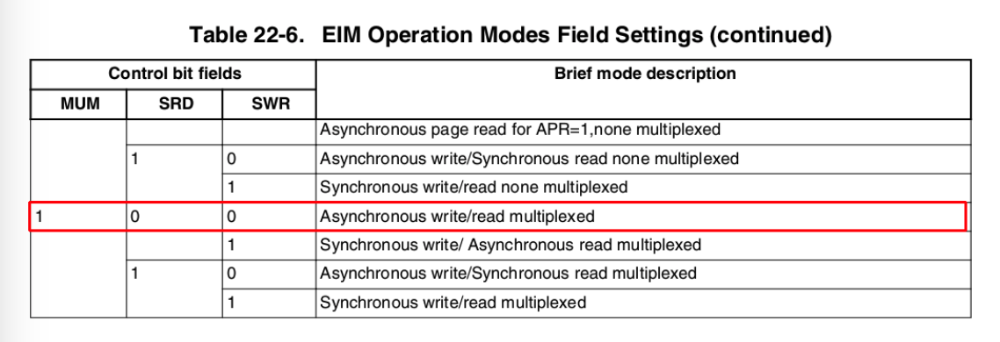
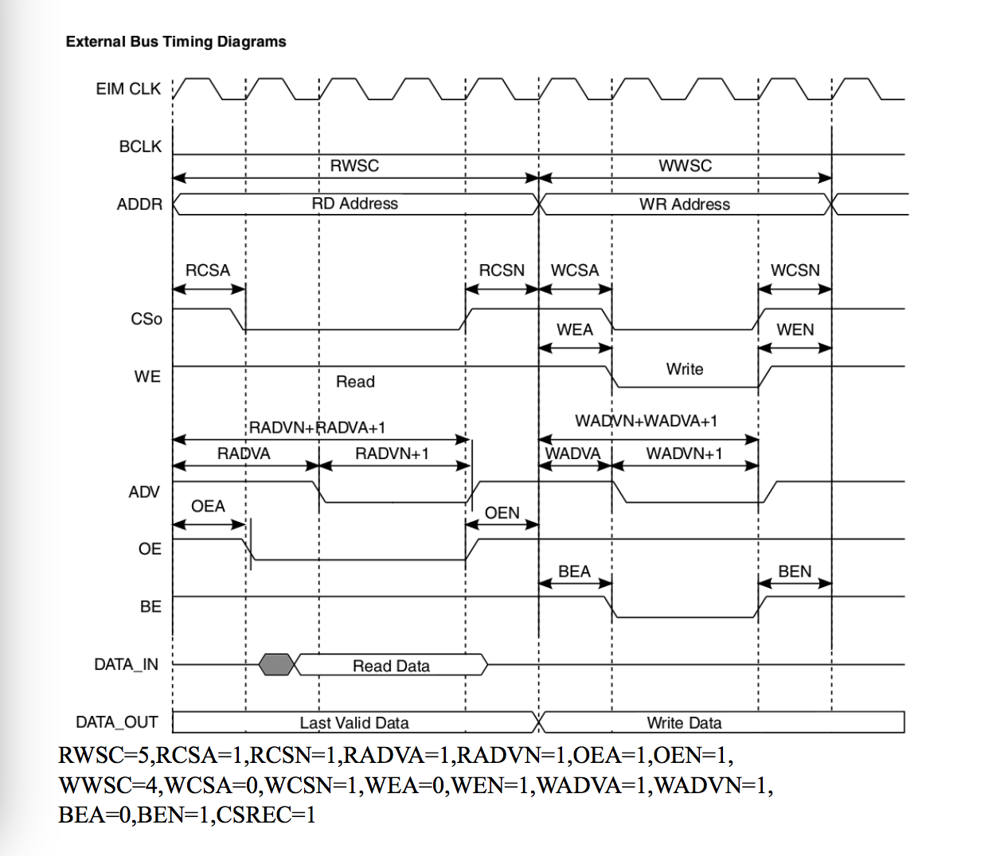
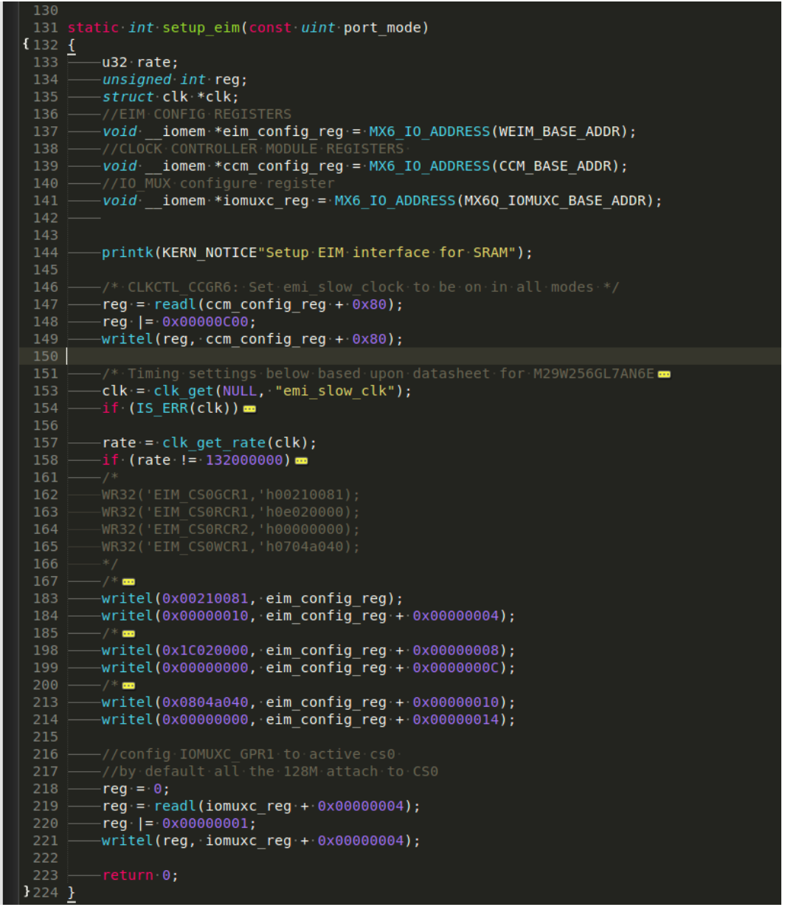
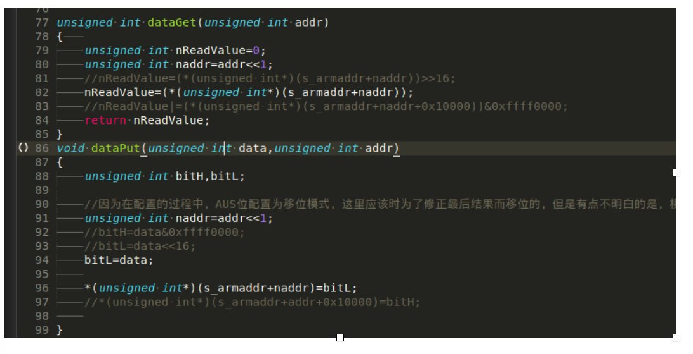

# EIM 异步复用模式配置核心要点

当时开发的平台式IMX6Q， 一个A9的平台， 在QT应用部分进展到一个无法前进的时候开始了EIM这个接口的扩展，当时其实挺窘迫的，项目的安排远远没有安排下来， 一致处于放养状态， 虽然说可以有很多的时间去探索和学习， 但是目标导向不明确，自己心中也有些动摇。

EIM主要用于外部内存的扩展用， 当时所里是用准备用它来接FPGA，相当于就是用FPGA来当内存，这样的好处显而易见。速度和实时性都有一定的保证，而且能解决FPGA和ARM互联互通。

freescale预留的接口可以满足绝大部分的需求， 但是在官方的版本上， 各个厂商会根据自己的功能需求，将EIM接口中部分甚至大部分IO复用到了其他功能至上。所以配置仅供参考，也仅仅是做个记录，其实自己也回忆不起来当时的这些了，忘记了该忘记的，记住自己该记住的，也许就够了，天下没有同样地树叶。所以它恐怕只是对视野和知识的扩展而已。

#### 下面基本上是当是的一个笔记

我们可用的信号\/引脚：

```
Addr ： A24-A16 DA15-DA0
Data ： DA15 - DA0
```

所以按照data sheet中得说明需要将MUM DSZ配置成如下，相当于选择了16bit非复用模式：

```
mum = 0；
Dsz  = 001；
```

And：如果在mum=1时，及复用时想使用异步读\/异步写的模式的话，下面连个寄存器需要按照说明设置如下

```
SRD = 0；
SWR = 0；
```


具体请参照datasheet 说明，重点在22章中：

#### 22.5.1 Bus Sizing Configuration

> **The EIM supports byte, half word and word operands allowing access to x8, x16, x32 ports. It can be address\/data multiplexed in x16, x32 ports. The port size is programmable via the DSZ bit field in the corresponding Chip Select Configuration Register. An 8-bit port can reside in each one of the bytes of the data bus. A 16-bit port can reside on the lower 16 bits of the data bus, DATA\_IN\/OUT\*\***\[****15:0\]**** or on the higher 16 bits of the data
> bus, DATA\_IN\/OUT****\[****31:16\]**\*\*.**
> 
> **In the case of a multi-cycle transfer, the lower two address bits \(ADDR\*\***\[****1:0\]****\) are incremented appropriately. The EIM address bus is configured according to DSZ bit field and AUS bits. There is either one bit \(for x16 port size\) or two bits \(for x32 port size\) right shift of the address bits \(only when AUS=0\) and no bit shift when AUS = 1 or DSZ****\[****2\]**\*\* = 1.
> The EIM has a data multiplexer which takes the four bytes of the AXI data bus and routes them to their required positions to properly interface to memory.**



#### 22.5.6 Multiplexed Address\/Data Mode Support

* The control bit MUM allows support memory with multiplexed address\/data bus both in asynchronous and in synchronous modes.
  Caution should be exercised for using OEA\/WEA & ADH bit fields. They should be configured according to the external device requirements, as it determines the time point of end of address phase and start of data phase.

* EIM\_OE:

  > Output Enable. This active-low output signal indicates the bus access is a read and enables external devices to drive the data bus with read data. Its behavior is affected by the OEA and OEN bit fields in the Chip Select Configuration Registers.

* EIM\_RW:

  > Memory Write Enable. This active-low output signal indicates the bus access is a write and enables external devices to sample the data bus. Its behavior is affected by the WEA and WEN bit fields in the Chip Select Configuration Registers.

* ADH:

  > ADH bit determine the address hold time after ADV negation in muxed mode


#### 22.5.9 WAIT\_B Signal, RWSC and WWSC bit fields Usage

* Most of the external devices supporting burst mode for write or read accesses provide a signal which indicates data is valid on the memory bus \(a.k.a. handshake mode\). For this mode, RFL and WFL bits should be cleared and RWSC\/ WWSC bit fields indicate when the controller should start sampling this signal from the external device or, in other words, how many BCLK cycles should be masked.
* For devices which do not use this signal or have a fixed latency ability, the RFL and WFL bits may be set for internal calculation regarding BCLK cycles penalty until data is valid \(memory initial access time\). For this mode, RWSC\/ WWSC indicates when the data is ready for sampling by the controller \(read access\) or the external device \(write access\). There is separation between read and write accesses wait-state control. For read access, RWSC bit field is valid and WWSC bit field is ignored; for write access, WWSC is valid and RWSC is ignored.

#### 22.8.3 Asynchronous Read\/Write Memory Accesses Timing Diagram



#### 核心寄存器代码配置16bin非复用

* 读写寄存器配置：
  

数据读写部分，这里的作用仅仅当把EIM作为字符设备打开操作的时候使用，其他时候推荐利用内存映射map函数进行读写。更安全和高效；

|  |
| :--- |
|

