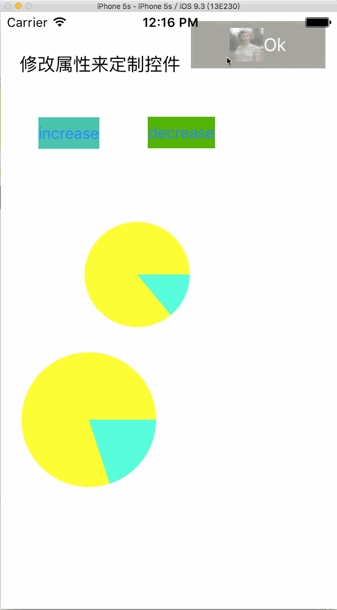

# 自定义控件与自绘控件

通过这一块的简单学习,get:

* 通过storyboard属性面板,修改相应的值来定制控件外观
* 通过view.addSubview\(subview\)接口从代码中添加子view
* 通过@IBDesignable 关键字导出class 到storyboard,从而使类中的修改实时的可以在storyboard中看到效果
* @IBInspectable 关键字将类其中的属性导出到storyboard中, 使得可以更方便的调整属性值,并预览效果
* 通过override drawRect方法 绘制自定义的组件

  
