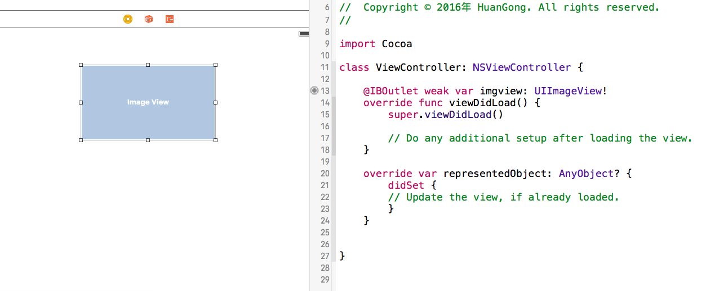

# UI与代码binding 的两种方法

## 传统方法

* method 1:

  > step 01: 在storyboard相应的ui控件或者controller对应的swift文件中添加@IBOutlet 标示和相应地变量声明  
  > step 02: 在storyboard中右击需要binding的控件，在弹出菜单中按住ctrl键选中referrence outlet 并拖动到左侧页面的document outline中选项中【选项就是你声明变量的那个类对应的viewcontroller或者navigate controller】  
  > step 03: 第二部当你松开鼠标会显示step 01中声明的变量， 点击选择 就完成了binding

* method 2：

  > 在document outline中选中需要UI对应的scene， 在右侧选择connections inspects，在右侧的Outlets变量中选取想binding的变量， 按住ctrl 键 拖到到相应地ui控件上  
  > 

## assistants editor

在storyboard界面打开ui类对应的assistants editor；按住ctrl键选中需要binding的ui控件并拖动到assistants editor代码中合适的位置， assistants editor 会自动弹出新建Outlet变量的对话框， 填写完毕即可自动的完成变量的创建和binding  
 

