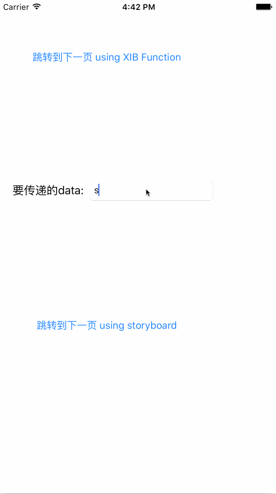

# UI的跳转和页面之间的数据传递

页面跳转其实就两种方式啦， 新的和旧的，当然了， 原理都是一样一样的嘛  
先来看看效果：

  


ios中得页面衔接有好几种， 之前我们用过通过push的方法，将子view 放到一个view stack中， ios默认会在界面上边存在一个返回箭头的；

* 使用导航栏压进新的控制器（push），
* 模态的加载视图控制器（modal），
* 自定义（custom） 没用过。

好了，到了这里，简单说一下storyboard下，利用segue界面跳转一共有两种方式：  
第一种就是以上我的例子，利用button组件，拖拽添加segue，直接运行就可以用。 【手势滑到切换】  
第二种是利用ViewController与ViewController之间，拖拽添加segue。不过，这种方法就需要在相应需要跳转的方法内写入代码，手动去设置它的跳转。

这里我们主要说得是设计方式上，一个是老的xib，一个是新的storyboard 其实都是一模一样的啦；  
先看两个函数的说明

```swift
    /*
      The next two methods are replacements for presentModalViewController:animated and
      dismissModalViewControllerAnimated: The completion handler, if provided, will be invoked after the presented
      controllers viewDidAppear: callback is invoked.
    */
    @available(iOS 5.0, *)
    public func presentViewController(viewControllerToPresent: UIViewController, animated flag: Bool, completion: (() -> Void)?)
    // The completion handler, if provided, will be invoked after the dismissed controller's viewDidDisappear: callback is invoked.
    @available(iOS 5.0, *)
    public func dismissViewControllerAnimated(flag: Bool, completion: (() -> Void)?)
```

## 主要的步骤：

### 在storyboard中设置跳转的方法一

> 进入

* 新建singleview 工程
* 在mainstoryboard中默认额view中拖入一个button
* 再拖入一个新的uiviewcontroller， 并在一个新的ui界面放入一个label来表示这是第二个页面， 同时放入一个返回button
* 按住ctrl在第一个segue的button上拖到第二个viewcontroller页面
* 为第二个viewcontroller界面设置一个类 secondUiviewcontroller.swift

运行点击按钮就能跳转到下一个页面

> 返回
>
> * 在类secondUiviewcontroller中通过代码编辑助手完成返回按钮和@IBACTION的绑定
> * 在IBAction代码中加入下列code，函数看上面的说明
>   ```swift
>     @IBAction func go_back_page() {
>       print("back")
>       self.dismissViewControllerAnimated(false) { 
>           print("sencond page dismissed completed")
>       }
>   }
>   ```

### 通过老的设计方式xib来跳转ui

> 进入
>
> * 新建一个基于UIviewcontroller的子类thirdViewcontroller，并勾选上create xib file 选项
> * 打开xib完成xib中得界面设计， 图中我加入了一个返回按钮和一个呈现数据的label
> * 在第一个主页面的viewcontroller.swift中添加一个新的button用于跳转到xib的这个页面， 
> * 同样通过@IBACTION 完成页面上得按钮和代码的binding，加入下面代码. 代码中也基本能看出是如何完成数据传递的了

```swift
    @IBAction func JumpToNextPage(sender: AnyObject) {
        print("go to next page")
        let xibViewController = ThirdUIViewController(nibName: "ThirdUIViewController", bundle: nil)
        xibViewController.textContentData = inputdata_field.text //数据传递

        presentViewController(xibViewController, animated: false) {
            print("present view controller finished")
        }
    }
```

> 返回， 返回是和storyboard中得动作一样的， 通过button或者其他的方式binding一个函数，在函数中调用下面这个函数即可

```
self.dismissViewControllerAnimated(false) { 
        print("sencond page dismissed completed")
}
```


