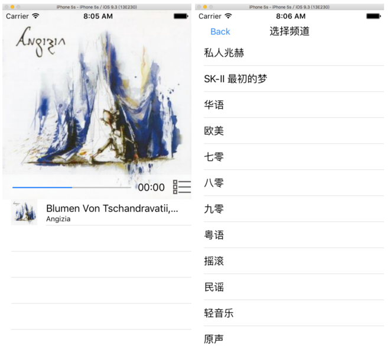

# 一个模仿某FM的实现

首先看看它长什么样, 估计有的人一看就知道我是照个某个博客抄袭的某个应用\/奸笑; 看图:



下面总结一下这个工程的流程和使用到得一些基本知识

## 应用到的基础知识

* storyboard 手动布局image, progressbar, tableview等元素
* 利用**NSURLSession**发起网络请求task,响应网络请求应答
* 利用**AVKit**播放流媒体, 完成流媒体播放的控制
* json数据的解析和转换
* 简单地使用QuartzCore 完成动画效果

除了上面这些基本的基本的东西之外, 几乎就剩下拖拽控件和将这些控件通过**IBOutlet**绑定到代码中了;

## 基本开发流程

* 首先完成UI的布局和页面跳转等整体的视觉上的东西
* 完成页面跳转逻辑和使用**IBOutlet,IBAction**绑定相关的Item
* 实现http请求,解析请求到得数据
* 将网络上获取到得歌曲信息通过下面函数来填充我们的tabview,将我们的数据binding到UI上

  ```
  func tableView(tableView: UITableView, cellForRowAtIndexPath indexPath: NSIndexPath) -> UITableViewCell
  ```

* 实现交互逻辑, 选择相应的cell后播放相应的歌曲,完成UI元素的update

  ```
   func tableView(tableView: UITableView, didSelectRowAtIndexPath indexPath: NSIndexPath) 
  ```

* 完成频道选择逻辑

* 为Cell添加简单地3D scale animation


下面是一些代码块

## 更新播放时间

```swift
audioplayer.addPeriodicTimeObserverForInterval(CMTimeMakeWithSeconds(1.0, 60),
                                               queue: nil,
                                               usingBlock: { 
             (t:CMTime)->Void in
             var time:String = "";
             let current_sec = CMTimeGetSeconds(t)
             let curTimeInt:Int = Int(current_sec)
             let sec:Int = curTimeInt % 60;
             let minute:Int = Int(curTimeInt/60)
             time = minute < 10 ? "0\(minute):" : "\(minute):";
             time += sec < 10 ? "0\(sec)" : "\(sec)";
             self.playtime.text = time;
 // update the progress view 
             if let item = (self.audioplayer.currentItem) {
                 let duaration_sec = CMTimeGetSeconds(item.duration);
                 if (duaration_sec.isNaN) { 
                     return
                 }
                 self.progressview.setProgress(Float(current_sec/duaration_sec), animated: true)
              }
})
```

## 网络请求
---

```swift
  let imgurl:NSURL = NSURL(string: url)!
  let request: NSURLRequest = NSURLRequest(URL: imgurl) 
  let urlSession = NSURLSession.sharedSession() 
  let datatask = urlSession.dataTaskWithRequest(request,
                                                completionHandler: {
      (data: NSData?, response: NSURLResponse?, error:NSError?)->Void in
      if (error != nil) { 
        print("url request load data error", error?.description) 
      } else if data != nil { 
        let img = UIImage(data: (data)!)
        self.imageCache[url] = img self.iv.image = img 
      } 
  })
  datatask.resume()
```
