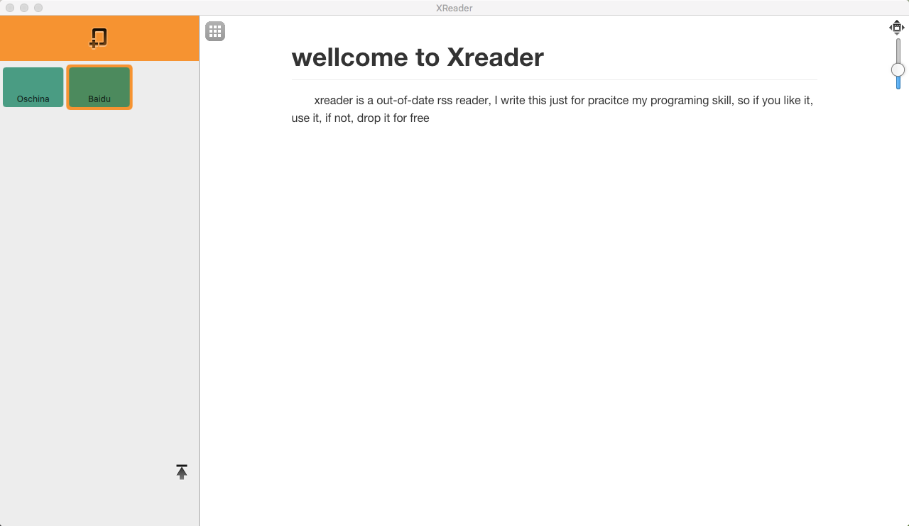
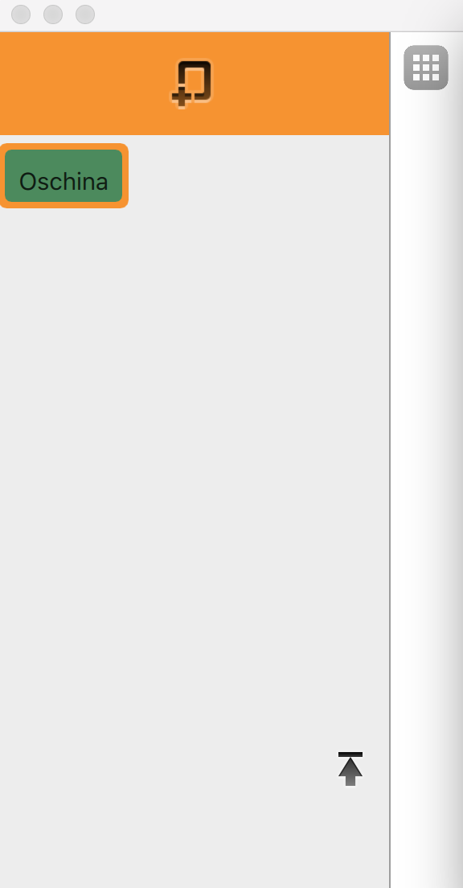
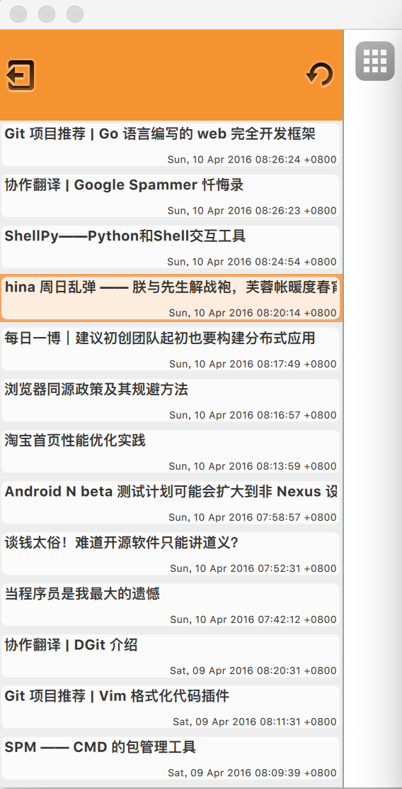
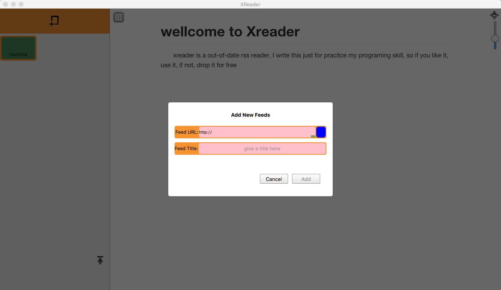
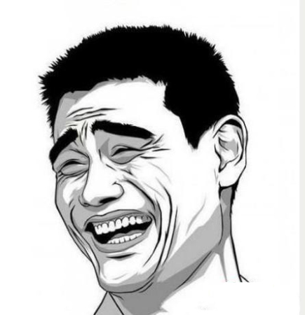

# The soX- th Project XReader

#### X 啥意思？ＸReader又是什么？

X代表着终极？ 未知？ 还是Apple 命名OSX中得ten？ 好吧，其实我也不知道究竟叫什么， 第x个我的项目，其实是我不知道这是第几个项目， 在小得项目在开始的第一天里它都是一个项目， 只是到了最后都不是项目了，或者最后连自己也不知道当时开始这个项目的时候是想做什么的了.

Xreader是我用Qt\/QML 编写的一个Rss阅读器， 因为自己一致对现在的各种各样的新闻报排斥态度，因为他们的出发点和我们的阅读新闻的出发点都不一样。我们更多地可能是像获取到某种信息， 而他们在传递这些新闻的时候可能更多地考虑到的是他\/她所编写的文章稿件的传播能力。所以找自己想看的东西越发不那么容易。所以我怀念起了Google Reader 和 以前在windows上所使用的RSS阅读器。而现在Google Reader恐怕能只能在清明节的时候烧把纸钱了。而其他的能获取到得RSS阅读器不是需要账号登陆就是需要绑定服务或者说需要money。好吧... 我得承认我没钱.
　　所以自己希望能写一个简陋的用用，我脑海里知道的UI Toolkit中我熟悉的用指头都能数的过来。考虑到我还在用windows和挚爱的Linux。所以就选择了Qt。另一方面这些ui开发我没有一个精通的。基本上属于hello world级别的。所以为了快平台。快速开发等等等等的原因，用了QML.{ps: 真实地原因还是相对而言熟悉一点}

先来看看它的靓照吧....。 其实很丑...

---

##### 整体结构

* 图一
  

借助于QML这种描述性脚本语言的特性。写这样的UI实在是太简单了。简单地都超出了我对桌面应用开发的理解。没写几行代码，事情基本上就搞定了。背后的动画原理基本上都不用脑子去考虑，对于我这种习惯了用C思维来思考的人，简直是中精神上的藐视...

【图一】中所看到的这种见面，其实代码写了不到500行，而有意义的代码估计能有100行就不错了。下面是几点QML的知识。

* **splitview** 
* **webengineView** Qt在5.4之后就引入了chromium项目作为web engine了，对于应用层面变化不大，暂时webengine的接口变化的比较快，改动也不较多，相信会慢慢地稳定下来。
* **StackView** {ps： 就是C中得一个栈，不过你push进去的时一个个页面而已}
* **QML中得MVC**————View - model - delegate

```
import QtQuick 2.4
import QtQuick.Controls 1.4
import QtQuick.Dialogs 1.2
import QtQuick.Layouts 1.3
import QtWebEngine 1.2

import "qrc:/src/XReaderWindow.js" as XReader

import "src"

ApplicationWindow {
    id: main_window
    visible: true
    width: 1280
    height: 720
    minimumHeight : 480
    minimumWidth : 640
    title: qsTr("XReader")

    menuBar: XMenu {
        id:main_menu
    }

    SplitView {
        id: splitView
        anchors.fill: parent

        Item {
            id: side_bar
            width: 280
            visible: true
            Layout.fillHeight: true
            Layout.maximumWidth: 300
            Layout.minimumWidth: 240

            StackView {
                id: stack_view
                anchors.fill: parent

                initialItem: FeedManagerView{
                    id: chanel_page
                    onSigChanelSelected: {
                        //article_list_view.model =  model_instance.feed
                        var article_list_view = article_list_component.createObject(stack_view);
                        article_list_view.setFeed(model_instance.feed)
                        article_list_view.articleClicked.connect(XReader.loadSelectedArticle);
                        article_list_view.backToMainPage.connect(XReader.backToFeedManagerView);
                        stack_view.push({item:article_list_view, destroyOnPop:true})
                    }

                    onSigShowAddFeedView: {
                        var component = Qt.createComponent("qrc:/src/AddNewFeedView.qml");
                        if (component.status === Component.Ready) {
                            var dlg = component.createObject(main_window, {});
                            dlg.sigOkPressed.connect(chanel_page.onAddNewFeed);
                        } else {
                            console.log("conmentnet not ready"+ component.errorString())
                        }
                    }
                }

                Component {
                    id: article_list_component
                    ArticleListView{
                        id: article_list_view
                        anchors.fill: parent
                    }
                }
            }
        }

        Item {
            id: conten_view
            anchors.top: parent.top
            anchors.right: parent.right
            anchors.bottom: parent.bottom
            Layout.alignment: Qt.AlignLeft | Qt.AlignBottom

            Loader { //the main content for display
                id: content_loader
                anchors.fill: parent
                source: "qrc:/src/ContentWebView.qml"
            }

            Image {
                id: app_menu
                width: 32; height: 32
                anchors.top: parent.top; anchors.topMargin: 6;
                anchors.left: parent.left; anchors.leftMargin: 6;
                source: "qrc:/image/icon/app-launcher.png"
                MouseArea {
                    anchors.fill: parent;
                    onClicked: {
                        XReader.openApplistView();
                    }
                }
            }

            Image {
                id: img_view_max
                width: 22; height: 22
                anchors.top: parent.top;anchors.topMargin: 6
                anchors.right: parent.right;anchors.rightMargin: 6
                source: "qrc:/image/icon/view-fullscreen.png"
                MouseArea {
                    anchors.fill: parent
                    onClicked: {
                        side_bar.visible = !side_bar.visible;
                        if (stack_view.visible === true) {
                            img_view_max.source = "qrc:/image/icon/view-fullscreen.png"
                        } else {
                            img_view_max.source = "qrc:/image/icon/view-restore.png"
                        }

                    }
                }
            }
        }
    }

}
```

上面的main.qml基本上能看出个大概接口，就是左边一个Feed管理的StackView。右边一个contentView用来展示内容，不过这里做了一点点内存和扩展上得优化，使用了一个Loader。这个Loader就好比一个占位置的指针。最后它展示什么取决于我们通过Loader导入了什么。所以这里当我们不需要显示或者想显示别的东西的时候都可以很灵活地处理。比如将Loader的Source属性设置成空（“”）这样就会在析构掉当前loader的界面。真的是内存管理的利器呀...

```
Loader { //the main content for display
     id: content_loader
     anchors.fill: parent
     source: "qrc:/src/ContentWebView.qml"
}
```

其实这段代码也让我之后做的一些小折腾变得可能。直接load一个另外一个功能模块就可以轻松地扩展这个应用。借助于qt的特性。这个source还可以是网络上的qml文件。所以真TMD方便。关键就这么几句话呀。用我这中习惯C家族的死脑筋真的是看的目瞪口呆呀...{^&^}（ps: 其实早就习惯了qml得这个特性...）main.qml 中那些**FeedManagerView** **ArticleListView**这些只不过是一些视图模块而已。就是这么简单；代码中绝大一部分都是定位和布局的代码，可以说几乎无关紧要！

---

##### FeedmannagerView 和 ArticleListView

* 图片二

|  |  |
| :--- | :--- |
|

这两个view就是你在main.qml文件中看到的那个stackview对应的两个view；只要我们依次把它们通过下面这个接口

```
stack_view.push({item:article_list_view, destroyOnPop:true})
```

接口push到stackview当中即可，其中push可以接收参数用来控制view的生命周期和一些属性的值，具体参考文档中得说明即可；不得不说一句Qt的文档还是做得相当好的。stackview还有一个属性 **initialItem**可以用来设置stackview的默认的第一个view，相当于在Component.onCompleted时将这个默认的view push进去而已；

```javascript
            StackView {
                id: stack_view
                anchors.fill: parent

                initialItem: FeedManagerView{
                    id: chanel_page
                    onSigChanelSelected: {
                        //article_list_view.model =  model_instance.feed
                        var article_list_view = article_list_component.createObject(stack_view);
                        article_list_view.setFeed(model_instance.feed)
                        article_list_view.articleClicked.connect(XReader.loadSelectedArticle);
                        article_list_view.backToMainPage.connect(XReader.backToFeedManagerView);
                        stack_view.push({item:article_list_view, destroyOnPop:true})
                    }

                    onSigShowAddFeedView: {
                        var component = Qt.createComponent("qrc:/src/AddNewFeedView.qml");
                        if (component.status === Component.Ready) {
                            var dlg = component.createObject(main_window, {});
                            dlg.sigOkPressed.connect(chanel_page.onAddNewFeed);
                        } else {
                            console.log("conmentnet not ready"+ component.errorString())
                        }
                    }
                }

                Component {
                    id: article_list_component
                    ArticleListView{
                        id: article_list_view
                        anchors.fill: parent
                    }
                }
            }
```

代码中_onSigShowAddFeedView_ 函数是响应用户点选择了某个feed之后的操作，为了节省内存{C程序员的天生特质！抓狂}这里是动态的创建的组件；QML中有两种常用的方式来动态创建or load一个组件;
1. Qt.createComponent + component.createObject
2. 通过Loader元素； 相当于一个占位符；

* 通过第一种创建的可以在组件需要销毁的地方调用destroy方法来销魂；这里qt文档中仅仅是说“放心。哪怕你是emit一个信号出去，你掉了destroy后我们忍让可以让你的信号被正确的处理，包括对资源变量的访问！” 所以放心用吧；
* 第二种方式就更容易管理了，你需要释放资源时，只要简单地通过Loader元素的**source 或者 sourceComponent**属性赋值为undefined或者”“即可；

##### 添加新feed的dialog

* 图三
  

这个对话框是不是特别有feel。一开始我尝试了平台原生的对话框。但是在mac上那个对话框弹出来之后立马给我吓坏了。所以最后把他做成这样了。其实就是一个半透明的overlayer + 圆角矩形（对话框实体\) 简单吧！
里面用了一些小技巧来保证你添加的url时一个可用的、可解析的feed.其实没什么特别的东西，感觉就是定位layout - 看效果 - 调整 - 看效果. 呵呵， 不过初期的设计也是一项拉，有个好的设计稿和规划做起来好很多；

* 不说了；看代码！

```javascript
import QtQuick 2.4
import QtQuick.XmlListModel 2.0
import QtWebEngine 1.2
import QtQuick.Controls 1.4


Item {
    signal sigOkPressed(var url, var name);
    signal sigComponentLoaded();

    id: dialogComponent
    anchors.fill: parent

    // Add a simple animation to fade in the popup, let the opacity go from 0 to 1 in 400ms
    PropertyAnimation { target: dialogComponent; property: "opacity";
        duration: 800; from: 0; to: 1;
        easing.type: Easing.InOutQuad ; running: true
    }

    // This rectange is the a overlay to partially show the parent through it
    // and clicking outside of the 'dialog' popup will do 'nothing'
    Rectangle {
        anchors.fill: parent
        id: overlay
        color: "#000000"
        opacity: 0.6
        MouseArea {
            anchors.fill: parent
            onWheel: {}
        }
    }

    // This rectangle is the actual popup

    Rectangle {
        id: dialogWindow

        radius: 4
        width: 420; height: 240
        anchors.horizontalCenter: parent.horizontalCenter
        anchors.verticalCenter: parent.verticalCenter

        Text {
            id: tag_add_new_feed
            font.bold: true
            text: qsTr("Add New Feeds")
            anchors.top: parent.top; anchors.topMargin: 24
            anchors.left: parent.left; anchors.leftMargin: (parent.width-width)/2
        }

        Column {
            id: column
            spacing: 10
            anchors.top: tag_add_new_feed.bottom; anchors.topMargin: 20
            anchors.left: parent.left; anchors.leftMargin: 16
            anchors.right: parent.right; anchors.rightMargin: 16

            Rectangle {
                id:row1
                radius: 4
                height: 32
                width: parent.width
                color: "#f69331"

                Text {
                    id: tag_feedurl
                    height: 24
                    text: qsTr("Feed URL:")
                    clip: true
                    anchors.left: parent.left; anchors.leftMargin: 2
                    anchors.verticalCenter: parent.verticalCenter

                    //font.bold: true
                    font.pointSize: height/2
                    textFormat: Text.PlainText
                    verticalAlignment: Text.AlignVCenter
                    horizontalAlignment: Text.AlignHCenter
                }

                Rectangle {
                    id: textInputContainer
                    radius: 4
                    color: "pink"
                    anchors.top: parent.top
                    anchors.right: img_feed_checker.left
                    anchors.bottom: parent.bottom
                    anchors.left: tag_feedurl.right
                    anchors.topMargin: 2
                    anchors.leftMargin: 2
                    anchors.rightMargin: 2
                    anchors.bottomMargin: 2


                    TextInput {
                        id: feed_url
                        clip: true
                        width: 200
                        height: 24
                        anchors.fill: parent
                        verticalAlignment: Text.AlignVCenter
                        //horizontalAlignment: Text.AlignHCenter
                        text: qsTr("http://")
                        font.bold: false
                        font.pointSize: 10
                        cursorVisible: false
                        onFocusChanged: {
                            if (focus === false && text !== qsTr("http://")) {
                                console.log("Log::::::onFocusChanged")
                                feedTestModel.source = text
                            } else if (focus === true) {
                                feed_url.color = "dark"
                            }
                        }
                        Rectangle {
                            id: file_selector
                            radius: 2
                            color: "green"
                            opacity: 0.5
                            width: 12; height: 6;
                            anchors.right: parent.right
                            anchors.bottom: parent.bottom
                        }
                    }
                    //statuscheck View
                }

                Rectangle {
                    id: img_feed_checker
                    color: "#000000"
                    width: 24
                    radius: 6
                    anchors.top: parent.top
                    anchors.right: parent.right
                    anchors.bottom: parent.bottom
                    //anchors.left: textInputContainer.right
                    anchors.topMargin: 2
                    anchors.leftMargin: 2
                    anchors.rightMargin: 2
                    anchors.bottomMargin: 2
                }
            }
            Rectangle {
                id:row2
                radius: 4
                height: 32; width: parent.width
                color: "#f69331"

                Text {
                    id: tag_title
                    height: 24
                    text: qsTr("Feed Title:")
                    anchors.left: parent.left
                    anchors.verticalCenter: parent.verticalCenter

                    font.pointSize: height/2
                    textFormat: Text.PlainText
                    verticalAlignment: Text.AlignVCenter
                    horizontalAlignment: Text.AlignHCenter
                }
                Rectangle {
                    id: feedTitleContainer
                    radius: 4
                    color: "pink"
                    anchors.top: parent.top
                    anchors.right: parent.right
                    anchors.bottom: parent.bottom
                    anchors.left: tag_title.right
                    anchors.topMargin: 2
                    anchors.leftMargin: 2
                    anchors.rightMargin: 2
                    anchors.bottomMargin: 2

                    TextInput {
                        id: feed_name
                        clip: true
                        anchors.fill: parent
                        verticalAlignment: Text.AlignVCenter
                        //horizontalAlignment: Text.AlignHCenter

                        text: qsTr("")
                        font.bold: false
                        font.pointSize: 10
                        cursorVisible: false
                        Text {
                            id: hint
                            opacity: 0.8
                            color: "gray"
                            anchors.centerIn: parent
                            verticalAlignment: Text.AlignVCenter
                            horizontalAlignment: Text.AlignHCenter
                            text: qsTr("give a title here")
                        }
                        onFocusChanged: {
                            if (focus === true) {
                                hint.visible = false;
                            } else {
                                var real_text = text.replace(/^\s+|\s+$/g, '' );
                                if (real_text !== qsTr("")) {
                                    hint.visible = false;
                                } else {
                                    hint.visible = true;
                                }
                            }
                        }
                    }
                }
            }

        }

        Row {
            id: row
            spacing: 10
            //anchors.top: column.bottom; anchors.topMargin: 32
            //anchors.left: parent.left; anchors.leftMargin: 42
            anchors.right: parent.right; anchors.rightMargin: 32
            anchors.bottom: parent.bottom; anchors.bottomMargin: 32

            Button {
                id: bt_cancle
                //anchors.right: ok.left
                //anchors.rightMargin: 10
                anchors.leftMargin: 40
                text: qsTr("Cancel")
                //anchors.bottom: parent.bottom
                //anchors.bottomMargin: 20
                onClicked: {
                    dialogComponent.destroy();
                }
            }

            Button {
                id: bt_ok
                enabled: false
                anchors.leftMargin: 40
                text: qsTr("  Add  ");
                onClicked: {
                    if (feed_url.text.length == 0) {
                        console.log("please input correctly url")
                        return;
                    }
                    sigOkPressed(feed_url.text, feed_name.text);
                    dialogComponent.destroy();
                }
            }
        }

    }
    Component.onCompleted: {
        console.log("addnew feed dlg component loaded")
    }


    XmlListModel {
        id: feedTestModel
        //source: "https://developer.ubuntu.com/en/blog/feeds/"
        query: "/rss/channel/item"
        XmlRole { name: "title"; query: "title/string()" }
        XmlRole { name: "link"; query: "link/string()" }
        XmlRole { name: "published"; query: "pubDate/string()" }
        onStatusChanged: {
            if (status === XmlListModel.Error) {
                console.log("error xml parse")
                feedVerifyFailed();
            } else if (status === XmlListModel.Loading) {
                img_feed_checker.color = "blue"
            } else if (status === XmlListModel.Ready) {
                var title = feedTestModel.get(0)
                console.log(title)
                if (title !== undefined) {
                    console.log("xmlListModel.Ready xml parse")
                    feedVerifySuccess();
                } else {
                    feedVerifyFailed();
                }
            }
        }

    }

    function feedVerifyFailed() {
        bt_ok.enabled = false
        feed_url.color = "red"
        img_feed_checker.color = "red"
    }

    function feedVerifySuccess() {
        bt_ok.enabled = true
        img_feed_checker.color = "green"

    }

}
```

##### WebContentView

这个没什么好说的，qt从webkit切换到Chromium作为webengine之后，使用起来没有什么大额问题，这里也是简简单单的使用它去load一个article的url而已；这里是将**WebEngineView**简单地封装了一下，加了一个控制zoomfactor的缩放条而已；so easy!

thanks！ that all:

| |
| :---: |

